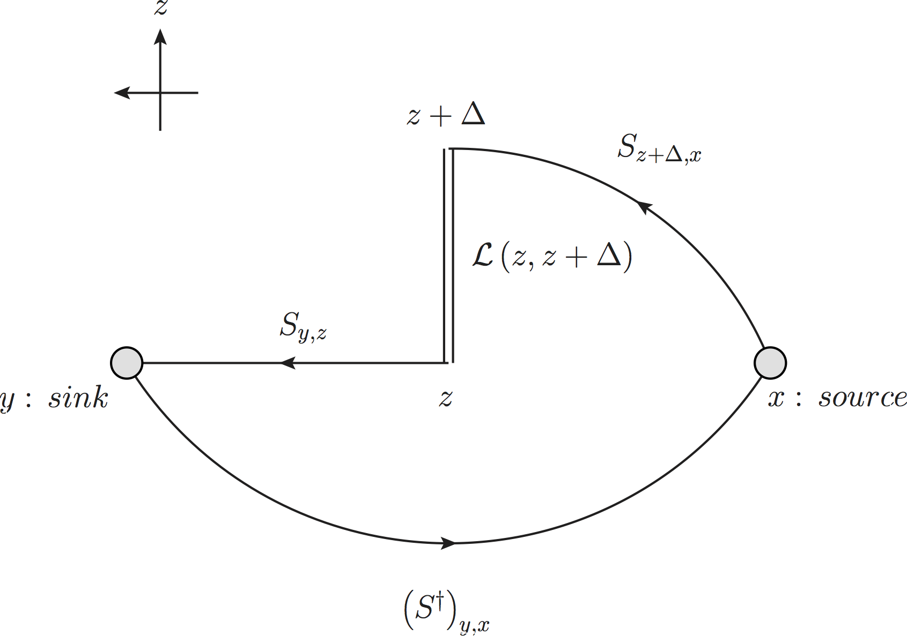

# Quark Propagator

The quark propagator $S_{x',x}$ is a $4\times4$ matrix with each element is a SU(3) color matrix. $S_{x',x}$ represents a quark propagating from source $x$ to site $x'$, in which $x'$ is the row index and x is the column index (for both Dirac spinor and color indices).

# Feynman-Hellman Method

Feynman-Hellman Method

 $$
 Src^{\mathrm{FH}}_{z,x} \left(\Delta\right)= \mathcal{L}\left(z,z+\Delta\right)\gamma^z S_{z+\Delta,x}
 $$
where $\mathcal{L}\left(z,z+\Delta\right)$ is the gauge link from $z$ to $z+\Delta$

 $$
 S^{\mathrm{FH}}_{y,x}\left(\Delta\right) = \sum_z \left(D\!\!\!\!/^{-1}\right)_{y,z} Src^{\mathrm{FH}}_{z,x}\left(\Delta\right)
 $$

 where $D\!\!\!\!/$denotes the Dirac operator hence $D\!\!\!\!/^{-1}$denotes the inversion.
 
 The correlation function is given by

 $$
C_{y,x}\left(\Delta\right)=\mathrm{tr}\left[\gamma^5\left(S^\dagger\right)_{y,x}\gamma^5 S^{\mathrm{FH}}_{y,x}\left(\Delta\right)\right]
 $$